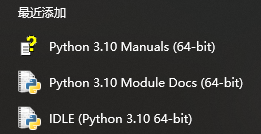
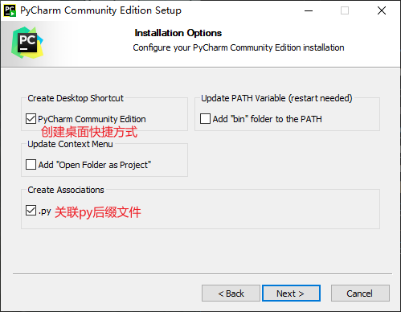
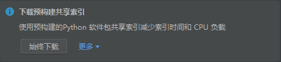

# Python入门简介
## 搭建开发环境  
### 下载python  
  - 推荐3.10.6版本(最后一个版本支持win7)[官网下载](https://www.python.org/ftp/python/3.10.6/python-3.10.6-amd64.exe)
  - 如果下载慢的话可以下载我lanzou提供的分流[蓝奏云盘](https://mc29.lanzouv.com/iM46L0g2ju4h)(二选一即可)
### 安装python  
  - 双击打开下载好的`python-3.10.6-amd64.exe`文件.  
    
  - 点击`Install Now`,如果出现黑屏弹窗选择 `是`  
    
### 验证安装
  - `win+r`打开命令窗口输入`cmd`回车.
  - 直接输入`python`看看是否出现类似画面,如果出现了即安装成功.
    ```ubuntu
    C:\Users\<你的用户名>python
    Python 3.10.6 (tags/v3.10.6:9c7b4bd, Aug  1 2022, 21:53:49) [MSC v.1932 64 bit (AMD64)] on win32
    Type "help", "copyright", "credits" or "license" for more information.
    >>>
    ```  
## 使用python自带的IDLE
- 点击IDLE即可打开.这里就不做介绍了.  
    
    
## 安装Pycharm community (可选) 
### 下载Pycharm community(专业版为付费项目,这里不做介绍)  
  - [jetbrains官网下载链接](https://download.jetbrains.com.cn/python/pycharm-community-2022.2.3.exe)  
### 安装pycharm  
  - 双击打开下载好的安装文件,点击Next.  
    
  - 如果C盘足够大不需要修改安装路径.  
    
  - 勾选你需要的选项.下一步直接点击`Install`.  
    
  - 完成安装.  
    

## 设置Pycharm community
### 创建第一个python项目
- 勾选后点击`Continue`  
     
- 点击`New project`新建一个项目.  
    
- 选择自己想要存放的目录.点击`Add interpreter`后选择`Add Local Interpreter`.
  
- 点击`System Interpreter`后右侧选择python安装路径.(图中为默认安装路径.)  
  
- 确认选择无误后点击`Create`即可创建第一个项目.
  
### 安装Pycharm插件
- 点击右上角齿轮然后选择`Plugins`  
    
- 在搜索界面输入`chinese`然后下载汉化插件,完成后点击`Restart IDE`即可汉化Pycharm.
  
- 如果右下角提示出现下载预构建共享索引,点击`始终下载`.  
    
- 继续打开插件下载界面下载你喜欢的插件.(个人推荐)  
  - Rainbow Brackets(彩色括号,不需要许可证也能用免费版功能)
### 运行python脚本文件
- 确保右下角没有正在运行的进程(比如正在下载共享索引).
  
- 直接在空白地方点击右键选择运行即可在左下角看到成功运行.
  
- 点击左下方终端后在下面输入`pip config set global.index-url https://pypi.tuna.tsinghua.edu.cn/simple`后回车即可修改pip下载源为清华源
    
- 如果遇到需要下载遇到的第三方库,可以将鼠标指向库名称后点击安装库.也可以在终端处输入`pip install numpy`(更换为自己的库名称进行安装)    
    
